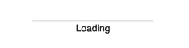

# vue-inertia-loader



## Install

```bash
npm i vue-inertia-loader
```

```js
import InertiaLoader from "vue-inertia-loader";

export default {
  name: "InertiaLoader",
  components: {
    InertiaLoader,
  },
};
```

## Usage

```html
<inertia-loader :loading="isLoading">Some dynamic content loaded</inertia-loader>
```

## Props

| Prop              | Type      | Required | Default                      | Description                     |
| ----------------- | --------- | -------- | ---------------------------- | ------------------------------- |
| `loading`         | `Boolean` | `false`  | `false`                      | Toggle animation                |
| `pulse`           | `Boolean` | `false`  | `false`                      | Toggle progress pulse animation |
| `text`            | `String`  | `false`  | `"Loading"`                  | Text label                      |
| `tag`             | `String`  | `false`  | `"div"`                      | Root HTML element tag           |
| `containerClass`  | `String`  | `false`  | `"inertia-loader"`           | Root CSS class                  |
| `barClass`        | `String`  | `false`  | `"inertia-loader__bar"`      | Bar CSS class                   |
| `progressClass`   | `String`  | `false`  | `"inertia-loader__progress"` | Progress CSS class              |
| `textClass`       | `String`  | `false`  | `"inertia-loader__text"`     | Text label CSS class            |
| `barBgColor`      | `String`  | `false`  | `"rgba(0, 0, 0, 0.15)"`      | Bar background color            |
| `progressBgColor` | `String`  | `false`  | `"rgba(0, 0, 0, 0.5)"`       | Progress background color       |
| `textColor`       | `String`  | `false`  | `"rgba(rgba(0, 0, 0, 0.9))"` | Text label color                |

## Slots

| Name           | Description                                               |
| -------------- | --------------------------------------------------------- |
| None (default) | Content that being displayed once loading flag is removed |
